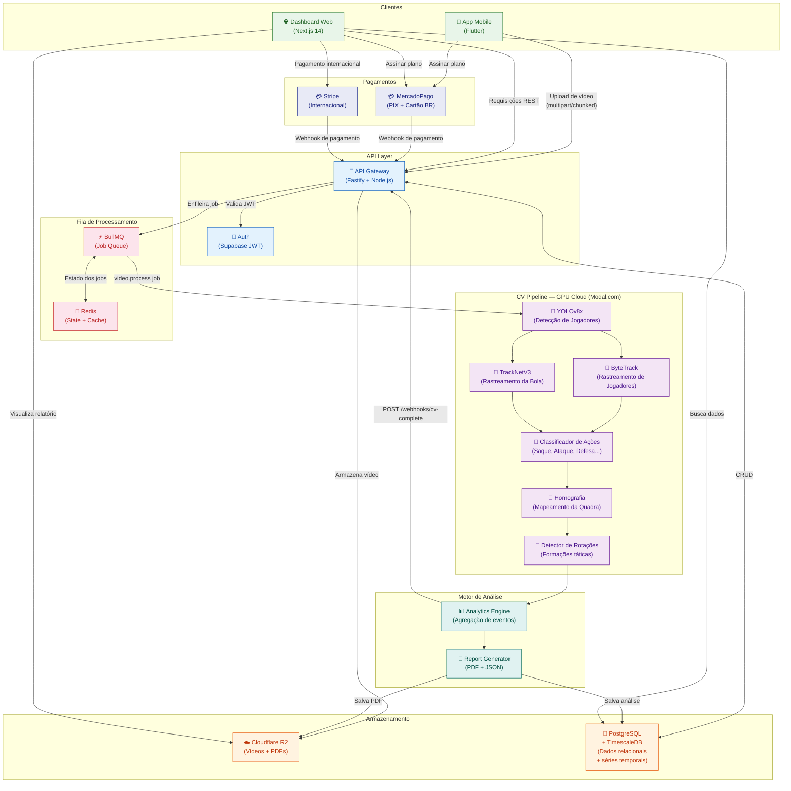
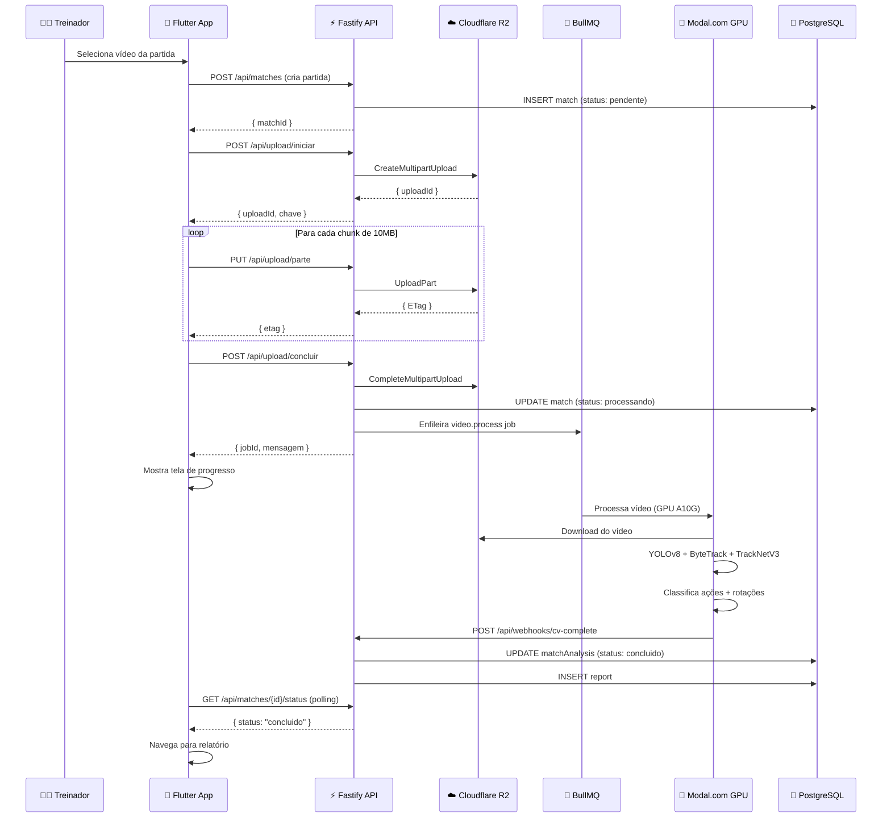

# Arquitetura do Sistema — VôleiAI

## Visão Geral

O VôleiAI é uma plataforma SaaS de análise de vôlei com IA, construída em arquitetura de microsserviços assíncronos com pipeline de visão computacional em GPU cloud.

## Diagrama de Componentes e Fluxo de Dados

## Fluxo Detalhado: Upload e Análise de Partida

## Componentes de Infraestrutura

| Componente | Serviço | Tier Inicial |
|------------|---------|--------------|
| API + Worker | Railway.app | Starter ($5/mês) |
| PostgreSQL | Railway.app | 1GB incluso |
| Redis | Railway.app | Incluso |
| Storage de vídeos | Cloudflare R2 | $0.015/GB/mês |
| GPU Pipeline | Modal.com | Pay-per-second |
| Auth | Supabase | Free tier |
| CDN | Cloudflare | Free tier |
| Web Dashboard | Vercel | Free tier |

## Considerações de Escala

- **Vídeos:** Cada partida ~2GB → R2 é crítico (zero egress fees)
- **GPU:** Modal.com escala a zero entre análises — sem custos idle
- **Concorrência:** Worker suporta 3 jobs simultâneos (configurável)
- **TimescaleDB:** Hypertable para `match_events` → queries de séries temporais 10-100x mais rápidas
